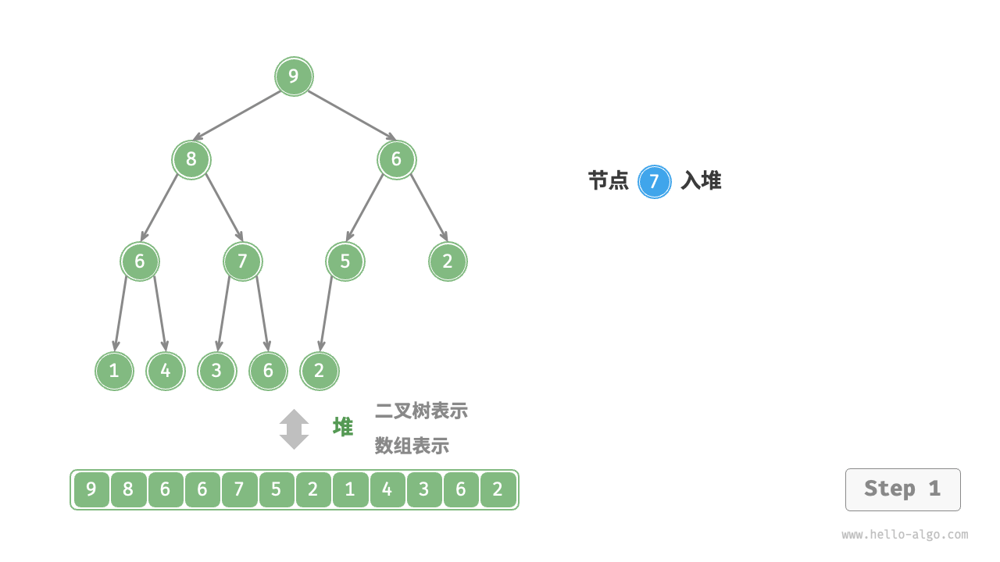
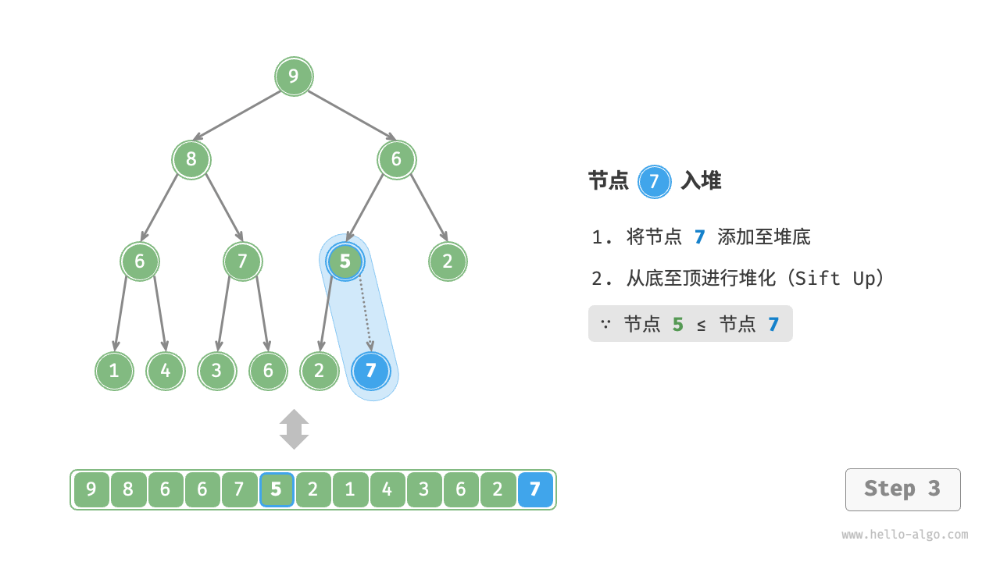
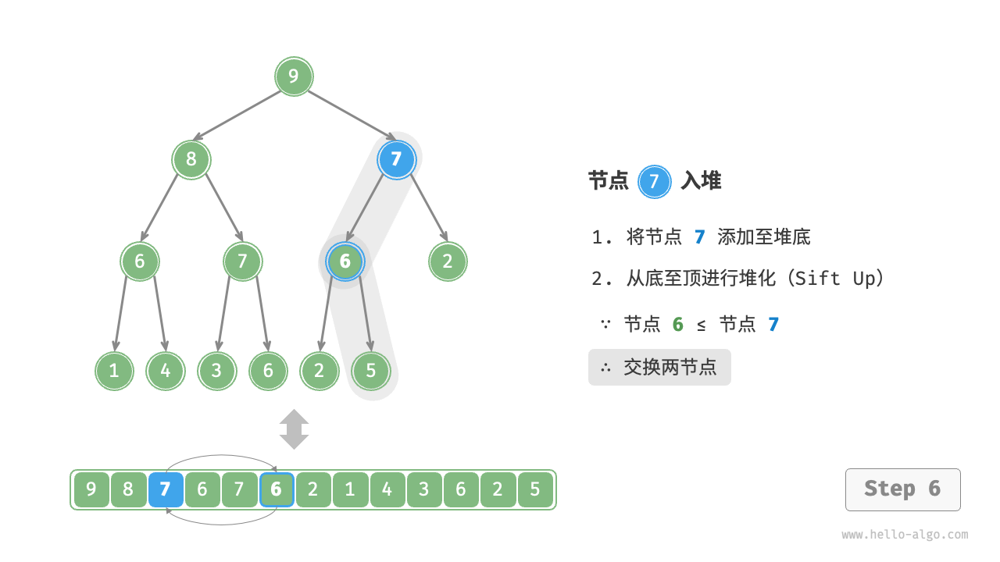
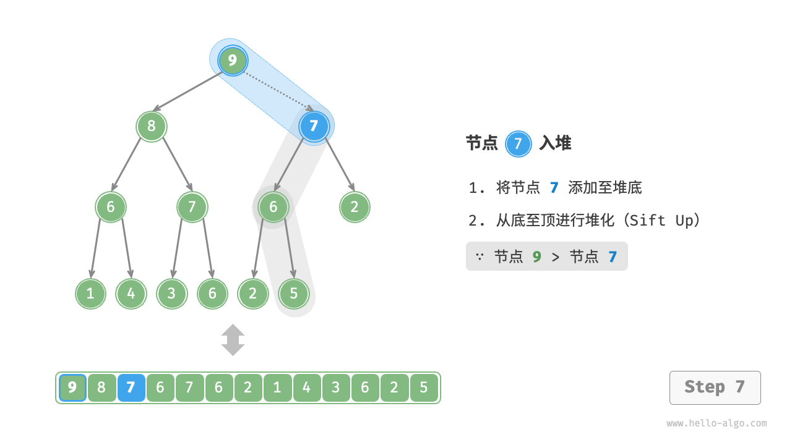
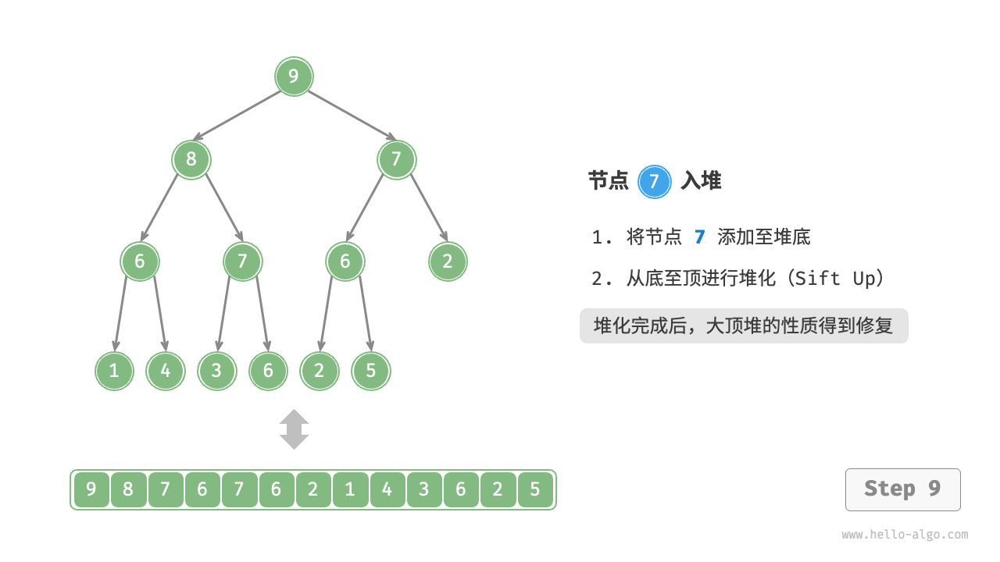
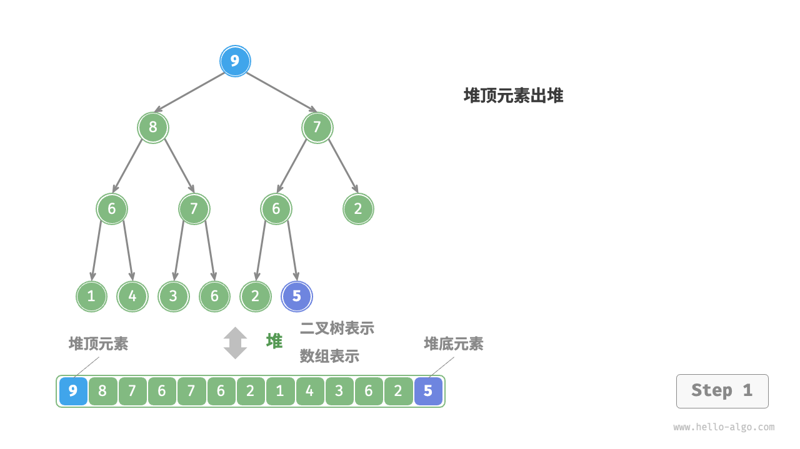
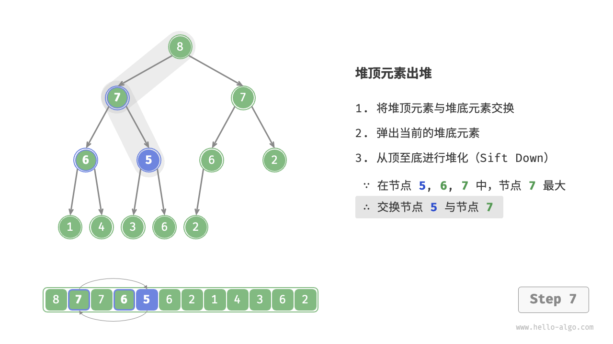
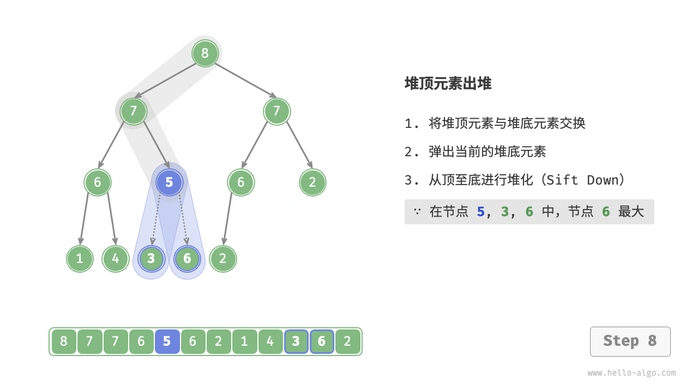

# 堆

<u>堆（heap）</u>是一种满足特定条件的完全二叉树，主要可分为两种类型，如下图所示。

- <u>小顶堆（min heap）</u>：任意节点的值 $\leq$ 其子节点的值。
- <u>大顶堆（max heap）</u>：任意节点的值 $\geq$ 其子节点的值。


堆作为完全二叉树的一个特例，具有以下特性。

- 最底层节点靠左填充，其他层的节点都被填满。
- 我们将二叉树的根节点称为“堆顶”，将底层最靠右的节点称为“堆底”。
- 对于大顶堆（小顶堆），堆顶元素（根节点）的值是最大（最小）的。

## 堆的常用操作

需要指出的是，许多编程语言提供的是<u>优先队列（priority queue）</u>，这是一种抽象的数据结构，定义为具有优先级排序的队列。

实际上，**堆通常用于实现优先队列，大顶堆相当于元素按从大到小的顺序出队的优先队列**。从使用角度来看，我们可以将“优先队列”和“堆”看作等价的数据结构。因此，本书对两者不做特别区分，统一称作“堆”。

堆的常用操作见下表，方法名需要根据编程语言来确定。

<p align="center"> 表 <id> &nbsp; 堆的操作效率 </p>

| 方法名      | 描述                                             | 时间复杂度  |
| ----------- | ------------------------------------------------ | ----------- |
| `push()`    | 元素入堆                                         | $O(\log n)$ |
| `pop()`     | 堆顶元素出堆                                     | $O(\log n)$ |
| `peek()`    | 访问堆顶元素（对于大 / 小顶堆分别为最大 / 小值） | $O(1)$      |
| `size()`    | 获取堆的元素数量                                 | $O(1)$      |
| `isEmpty()` | 判断堆是否为空                                   | $O(1)$      |

在实际应用中，我们可以直接使用编程语言提供的堆类（或优先队列类）。

类似于排序算法中的“从小到大排列”和“从大到小排列”，我们可以通过设置一个 `flag` 或修改 `Comparator` 实现“小顶堆”与“大顶堆”之间的转换。代码如下所示：

=== "Python"

    ```python title="heap.py"
    # 初始化小顶堆
    min_heap, flag = [], 1
    # 初始化大顶堆
    max_heap, flag = [], -1

    # Python 的 heapq 模块默认实现小顶堆
    # 考虑将“元素取负”后再入堆，这样就可以将大小关系颠倒，从而实现大顶堆
    # 在本示例中，flag = 1 时对应小顶堆，flag = -1 时对应大顶堆

    # 元素入堆
    heapq.heappush(max_heap, flag * 1)
    heapq.heappush(max_heap, flag * 3)
    heapq.heappush(max_heap, flag * 2)
    heapq.heappush(max_heap, flag * 5)
    heapq.heappush(max_heap, flag * 4)

    # 获取堆顶元素
    peek: int = flag * max_heap[0] # 5

    # 堆顶元素出堆
    # 出堆元素会形成一个从大到小的序列
    val = flag * heapq.heappop(max_heap) # 5
    val = flag * heapq.heappop(max_heap) # 4
    val = flag * heapq.heappop(max_heap) # 3
    val = flag * heapq.heappop(max_heap) # 2
    val = flag * heapq.heappop(max_heap) # 1

    # 获取堆大小
    size: int = len(max_heap)

    # 判断堆是否为空
    is_empty: bool = not max_heap

    # 输入列表并建堆
    min_heap: list[int] = [1, 3, 2, 5, 4]
    heapq.heapify(min_heap)
    ```

=== "C++"

    ```cpp title="heap.cpp"
    /* 初始化堆 */
    // 初始化小顶堆
    priority_queue<int, vector<int>, greater<int>> minHeap;
    // 初始化大顶堆
    priority_queue<int, vector<int>, less<int>> maxHeap;

    /* 元素入堆 */
    maxHeap.push(1);
    maxHeap.push(3);
    maxHeap.push(2);
    maxHeap.push(5);
    maxHeap.push(4);

    /* 获取堆顶元素 */
    int peek = maxHeap.top(); // 5

    /* 堆顶元素出堆 */
    // 出堆元素会形成一个从大到小的序列
    maxHeap.pop(); // 5
    maxHeap.pop(); // 4
    maxHeap.pop(); // 3
    maxHeap.pop(); // 2
    maxHeap.pop(); // 1

    /* 获取堆大小 */
    int size = maxHeap.size();

    /* 判断堆是否为空 */
    bool isEmpty = maxHeap.empty();

    /* 输入列表并建堆 */
    vector<int> input{1, 3, 2, 5, 4};
    priority_queue<int, vector<int>, greater<int>> minHeap(input.begin(), input.end());
    ```

=== "Java"

    ```java title="heap.java"
    /* 初始化堆 */
    // 初始化小顶堆
    Queue<Integer> minHeap = new PriorityQueue<>();
    // 初始化大顶堆（使用 lambda 表达式修改 Comparator 即可）
    Queue<Integer> maxHeap = new PriorityQueue<>((a, b) -> b - a);
    
    /* 元素入堆 */
    maxHeap.offer(1);
    maxHeap.offer(3);
    maxHeap.offer(2);
    maxHeap.offer(5);
    maxHeap.offer(4);
    
    /* 获取堆顶元素 */
    int peek = maxHeap.peek(); // 5
    
    /* 堆顶元素出堆 */
    // 出堆元素会形成一个从大到小的序列
    peek = maxHeap.poll(); // 5
    peek = maxHeap.poll(); // 4
    peek = maxHeap.poll(); // 3
    peek = maxHeap.poll(); // 2
    peek = maxHeap.poll(); // 1
    
    /* 获取堆大小 */
    int size = maxHeap.size();
    
    /* 判断堆是否为空 */
    boolean isEmpty = maxHeap.isEmpty();
    
    /* 输入列表并建堆 */
    minHeap = new PriorityQueue<>(Arrays.asList(1, 3, 2, 5, 4));
    ```

=== "C#"

    ```csharp title="heap.cs"
    /* 初始化堆 */
    // 初始化小顶堆
    PriorityQueue<int, int> minHeap = new();
    // 初始化大顶堆（使用 lambda 表达式修改 Comparator 即可）
    PriorityQueue<int, int> maxHeap = new(Comparer<int>.Create((x, y) => y - x));

    /* 元素入堆 */
    maxHeap.Enqueue(1, 1);
    maxHeap.Enqueue(3, 3);
    maxHeap.Enqueue(2, 2);
    maxHeap.Enqueue(5, 5);
    maxHeap.Enqueue(4, 4);

    /* 获取堆顶元素 */
    int peek = maxHeap.Peek();//5

    /* 堆顶元素出堆 */
    // 出堆元素会形成一个从大到小的序列
    peek = maxHeap.Dequeue();  // 5
    peek = maxHeap.Dequeue();  // 4
    peek = maxHeap.Dequeue();  // 3
    peek = maxHeap.Dequeue();  // 2
    peek = maxHeap.Dequeue();  // 1

    /* 获取堆大小 */
    int size = maxHeap.Count;

    /* 判断堆是否为空 */
    bool isEmpty = maxHeap.Count == 0;

    /* 输入列表并建堆 */
    minHeap = new PriorityQueue<int, int>([(1, 1), (3, 3), (2, 2), (5, 5), (4, 4)]);
    ```

=== "Go"

    ```go title="heap.go"
    // Go 语言中可以通过实现 heap.Interface 来构建整数大顶堆
    // 实现 heap.Interface 需要同时实现 sort.Interface
    type intHeap []any

    // Push heap.Interface 的方法，实现推入元素到堆
    func (h *intHeap) Push(x any) {
        // Push 和 Pop 使用 pointer receiver 作为参数
        // 因为它们不仅会对切片的内容进行调整，还会修改切片的长度。
        *h = append(*h, x.(int))
    }

    // Pop heap.Interface 的方法，实现弹出堆顶元素
    func (h *intHeap) Pop() any {
        // 待出堆元素存放在最后
        last := (*h)[len(*h)-1]
        *h = (*h)[:len(*h)-1]
        return last
    }

    // Len sort.Interface 的方法
    func (h *intHeap) Len() int {
        return len(*h)
    }

    // Less sort.Interface 的方法
    func (h *intHeap) Less(i, j int) bool {
        // 如果实现小顶堆，则需要调整为小于号
        return (*h)[i].(int) > (*h)[j].(int)
    }

    // Swap sort.Interface 的方法
    func (h *intHeap) Swap(i, j int) {
        (*h)[i], (*h)[j] = (*h)[j], (*h)[i]
    }

    // Top 获取堆顶元素
    func (h *intHeap) Top() any {
        return (*h)[0]
    }

    /* Driver Code */
    func TestHeap(t *testing.T) {
        /* 初始化堆 */
        // 初始化大顶堆
        maxHeap := &intHeap{}
        heap.Init(maxHeap)
        /* 元素入堆 */
        // 调用 heap.Interface 的方法，来添加元素
        heap.Push(maxHeap, 1)
        heap.Push(maxHeap, 3)
        heap.Push(maxHeap, 2)
        heap.Push(maxHeap, 4)
        heap.Push(maxHeap, 5)

        /* 获取堆顶元素 */
        top := maxHeap.Top()
        fmt.Printf("堆顶元素为 %d\n", top)

        /* 堆顶元素出堆 */
        // 调用 heap.Interface 的方法，来移除元素
        heap.Pop(maxHeap) // 5
        heap.Pop(maxHeap) // 4
        heap.Pop(maxHeap) // 3
        heap.Pop(maxHeap) // 2
        heap.Pop(maxHeap) // 1

        /* 获取堆大小 */
        size := len(*maxHeap)
        fmt.Printf("堆元素数量为 %d\n", size)

        /* 判断堆是否为空 */
        isEmpty := len(*maxHeap) == 0
        fmt.Printf("堆是否为空 %t\n", isEmpty)
    }
    ```

=== "Swift"

    ```swift title="heap.swift"
    /* 初始化堆 */
    // Swift 的 Heap 类型同时支持最大堆和最小堆，且需要引入 swift-collections
    var heap = Heap<Int>()

    /* 元素入堆 */
    heap.insert(1)
    heap.insert(3)
    heap.insert(2)
    heap.insert(5)
    heap.insert(4)

    /* 获取堆顶元素 */
    var peek = heap.max()!

    /* 堆顶元素出堆 */
    peek = heap.removeMax() // 5
    peek = heap.removeMax() // 4
    peek = heap.removeMax() // 3
    peek = heap.removeMax() // 2
    peek = heap.removeMax() // 1

    /* 获取堆大小 */
    let size = heap.count

    /* 判断堆是否为空 */
    let isEmpty = heap.isEmpty

    /* 输入列表并建堆 */
    let heap2 = Heap([1, 3, 2, 5, 4])
    ```

=== "JS"

    ```javascript title="heap.js"
    // JavaScript 未提供内置 Heap 类
    ```

=== "TS"

    ```typescript title="heap.ts"
    // TypeScript 未提供内置 Heap 类
    ```

=== "Dart"

    ```dart title="heap.dart"
    // Dart 未提供内置 Heap 类
    ```

=== "Rust"

    ```rust title="heap.rs"
    use std::collections::BinaryHeap;
    use std::cmp::Reverse;

    /* 初始化堆 */
    // 初始化小顶堆
    let mut min_heap = BinaryHeap::<Reverse<i32>>::new();
    // 初始化大顶堆
    let mut max_heap = BinaryHeap::new();

    /* 元素入堆 */
    max_heap.push(1);
    max_heap.push(3);
    max_heap.push(2);
    max_heap.push(5);
    max_heap.push(4);
    
    /* 获取堆顶元素 */
    let peek = max_heap.peek().unwrap();  // 5

    /* 堆顶元素出堆 */
    // 出堆元素会形成一个从大到小的序列
    let peek = max_heap.pop().unwrap();   // 5
    let peek = max_heap.pop().unwrap();   // 4
    let peek = max_heap.pop().unwrap();   // 3
    let peek = max_heap.pop().unwrap();   // 2
    let peek = max_heap.pop().unwrap();   // 1

    /* 获取堆大小 */
    let size = max_heap.len();

    /* 判断堆是否为空 */
    let is_empty = max_heap.is_empty();

    /* 输入列表并建堆 */
    let min_heap = BinaryHeap::from(vec![Reverse(1), Reverse(3), Reverse(2), Reverse(5), Reverse(4)]);
    ```

=== "C"

    ```c title="heap.c"
    // C 未提供内置 Heap 类
    ```

=== "Kotlin"

    ```kotlin title="heap.kt"
    /* 初始化堆 */
    // 初始化小顶堆
    var minHeap = PriorityQueue<Int>()
    // 初始化大顶堆（使用 lambda 表达式修改 Comparator 即可）
    val maxHeap = PriorityQueue { a: Int, b: Int -> b - a }
    
    /* 元素入堆 */
    maxHeap.offer(1)
    maxHeap.offer(3)
    maxHeap.offer(2)
    maxHeap.offer(5)
    maxHeap.offer(4)
    
    /* 获取堆顶元素 */
    var peek = maxHeap.peek() // 5
    
    /* 堆顶元素出堆 */
    // 出堆元素会形成一个从大到小的序列
    peek = maxHeap.poll() // 5
    peek = maxHeap.poll() // 4
    peek = maxHeap.poll() // 3
    peek = maxHeap.poll() // 2
    peek = maxHeap.poll() // 1
    
    /* 获取堆大小 */
    val size = maxHeap.size
    
    /* 判断堆是否为空 */
    val isEmpty = maxHeap.isEmpty()
    
    /* 输入列表并建堆 */
    minHeap = PriorityQueue(mutableListOf(1, 3, 2, 5, 4))
    ```

=== "Ruby"

    ```ruby title="heap.rb"

    ```

=== "Zig"

    ```zig title="heap.zig"

    ```

??? pythontutor "可视化运行"

    https://pythontutor.com/render.html#code=import%20heapq%0A%0A%22%22%22Driver%20Code%22%22%22%0Aif%20__name__%20%3D%3D%20%22__main__%22%3A%0A%20%20%20%20%23%20%E5%88%9D%E5%A7%8B%E5%8C%96%E5%B0%8F%E9%A1%B6%E5%A0%86%0A%20%20%20%20min_heap,%20flag%20%3D%20%5B%5D,%201%0A%20%20%20%20%23%20%E5%88%9D%E5%A7%8B%E5%8C%96%E5%A4%A7%E9%A1%B6%E5%A0%86%0A%20%20%20%20max_heap,%20flag%20%3D%20%5B%5D,%20-1%0A%20%20%20%20%0A%20%20%20%20%23%20Python%20%E7%9A%84%20heapq%20%E6%A8%A1%E5%9D%97%E9%BB%98%E8%AE%A4%E5%AE%9E%E7%8E%B0%E5%B0%8F%E9%A1%B6%E5%A0%86%0A%20%20%20%20%23%20%E8%80%83%E8%99%91%E5%B0%86%E2%80%9C%E5%85%83%E7%B4%A0%E5%8F%96%E8%B4%9F%E2%80%9D%E5%90%8E%E5%86%8D%E5%85%A5%E5%A0%86%EF%BC%8C%E8%BF%99%E6%A0%B7%E5%B0%B1%E5%8F%AF%E4%BB%A5%E5%B0%86%E5%A4%A7%E5%B0%8F%E5%85%B3%E7%B3%BB%E9%A2%A0%E5%80%92%EF%BC%8C%E4%BB%8E%E8%80%8C%E5%AE%9E%E7%8E%B0%E5%A4%A7%E9%A1%B6%E5%A0%86%0A%20%20%20%20%23%20%E5%9C%A8%E6%9C%AC%E7%A4%BA%E4%BE%8B%E4%B8%AD%EF%BC%8Cflag%20%3D%201%20%E6%97%B6%E5%AF%B9%E5%BA%94%E5%B0%8F%E9%A1%B6%E5%A0%86%EF%BC%8Cflag%20%3D%20-1%20%E6%97%B6%E5%AF%B9%E5%BA%94%E5%A4%A7%E9%A1%B6%E5%A0%86%0A%20%20%20%20%0A%20%20%20%20%23%20%E5%85%83%E7%B4%A0%E5%85%A5%E5%A0%86%0A%20%20%20%20heapq.heappush%28max_heap,%20flag%20*%201%29%0A%20%20%20%20heapq.heappush%28max_heap,%20flag%20*%203%29%0A%20%20%20%20heapq.heappush%28max_heap,%20flag%20*%202%29%0A%20%20%20%20heapq.heappush%28max_heap,%20flag%20*%205%29%0A%20%20%20%20heapq.heappush%28max_heap,%20flag%20*%204%29%0A%20%20%20%20%0A%20%20%20%20%23%20%E8%8E%B7%E5%8F%96%E5%A0%86%E9%A1%B6%E5%85%83%E7%B4%A0%0A%20%20%20%20peek%20%3D%20flag%20*%20max_heap%5B0%5D%20%23%205%0A%20%20%20%20%0A%20%20%20%20%23%20%E5%A0%86%E9%A1%B6%E5%85%83%E7%B4%A0%E5%87%BA%E5%A0%86%0A%20%20%20%20%23%20%E5%87%BA%E5%A0%86%E5%85%83%E7%B4%A0%E4%BC%9A%E5%BD%A2%E6%88%90%E4%B8%80%E4%B8%AA%E4%BB%8E%E5%A4%A7%E5%88%B0%E5%B0%8F%E7%9A%84%E5%BA%8F%E5%88%97%0A%20%20%20%20val%20%3D%20flag%20*%20heapq.heappop%28max_heap%29%20%23%205%0A%20%20%20%20val%20%3D%20flag%20*%20heapq.heappop%28max_heap%29%20%23%204%0A%20%20%20%20val%20%3D%20flag%20*%20heapq.heappop%28max_heap%29%20%23%203%0A%20%20%20%20val%20%3D%20flag%20*%20heapq.heappop%28max_heap%29%20%23%202%0A%20%20%20%20val%20%3D%20flag%20*%20heapq.heappop%28max_heap%29%20%23%201%0A%20%20%20%20%0A%20%20%20%20%23%20%E8%8E%B7%E5%8F%96%E5%A0%86%E5%A4%A7%E5%B0%8F%0A%20%20%20%20size%20%3D%20len%28max_heap%29%0A%20%20%20%20%0A%20%20%20%20%23%20%E5%88%A4%E6%96%AD%E5%A0%86%E6%98%AF%E5%90%A6%E4%B8%BA%E7%A9%BA%0A%20%20%20%20is_empty%20%3D%20not%20max_heap%0A%20%20%20%20%0A%20%20%20%20%23%20%E8%BE%93%E5%85%A5%E5%88%97%E8%A1%A8%E5%B9%B6%E5%BB%BA%E5%A0%86%0A%20%20%20%20min_heap%20%3D%20%5B1,%203,%202,%205,%204%5D%0A%20%20%20%20heapq.heapify%28min_heap%29&cumulative=false&curInstr=3&heapPrimitives=nevernest&mode=display&origin=opt-frontend.js&py=311&rawInputLstJSON=%5B%5D&textReferences=false

## 堆的实现

下文实现的是大顶堆。若要将其转换为小顶堆，只需将所有大小逻辑判断取逆（例如，将 $\geq$ 替换为 $\leq$ ）。感兴趣的读者可以自行实现。

### 堆的存储与表示

“二叉树”章节讲过，完全二叉树非常适合用数组来表示。由于堆正是一种完全二叉树，**因此我们将采用数组来存储堆**。

当使用数组表示二叉树时，元素代表节点值，索引代表节点在二叉树中的位置。**节点指针通过索引映射公式来实现**。

如下图所示，给定索引 $i$ ，其左子节点的索引为 $2i + 1$ ，右子节点的索引为 $2i + 2$ ，父节点的索引为 $(i - 1) / 2$（向下整除）。当索引越界时，表示空节点或节点不存在。


我们可以将索引映射公式封装成函数，方便后续使用：

```src
[file]{my_heap}-[class]{max_heap}-[func]{parent}
```

### 访问堆顶元素

堆顶元素即为二叉树的根节点，也就是列表的首个元素：

```src
[file]{my_heap}-[class]{max_heap}-[func]{peek}
```

### 元素入堆

给定元素 `val` ，我们首先将其添加到堆底。添加之后，由于 `val` 可能大于堆中其他元素，堆的成立条件可能已被破坏，**因此需要修复从插入节点到根节点的路径上的各个节点**，这个操作被称为<u>堆化（heapify）</u>。

考虑从入堆节点开始，**从底至顶执行堆化**。如下图所示，我们比较插入节点与其父节点的值，如果插入节点更大，则将它们交换。然后继续执行此操作，从底至顶修复堆中的各个节点，直至越过根节点或遇到无须交换的节点时结束。

=== "<1>"
    

=== "<2>"
    

=== "<3>"
    

=== "<4>"
    

=== "<5>"
    

=== "<6>"
    

=== "<7>"
    

=== "<8>"
    

=== "<9>"
    

设节点总数为 $n$ ，则树的高度为 $O(\log n)$ 。由此可知，堆化操作的循环轮数最多为 $O(\log n)$ ，**元素入堆操作的时间复杂度为 $O(\log n)$** 。代码如下所示：

```src
[file]{my_heap}-[class]{max_heap}-[func]{sift_up}
```

### 堆顶元素出堆

堆顶元素是二叉树的根节点，即列表首元素。如果我们直接从列表中删除首元素，那么二叉树中所有节点的索引都会发生变化，这将使得后续使用堆化进行修复变得困难。为了尽量减少元素索引的变动，我们采用以下操作步骤。

1. 交换堆顶元素与堆底元素（交换根节点与最右叶节点）。
2. 交换完成后，将堆底从列表中删除（注意，由于已经交换，因此实际上删除的是原来的堆顶元素）。
3. 从根节点开始，**从顶至底执行堆化**。

如下图所示，**“从顶至底堆化”的操作方向与“从底至顶堆化”相反**，我们将根节点的值与其两个子节点的值进行比较，将最大的子节点与根节点交换。然后循环执行此操作，直到越过叶节点或遇到无须交换的节点时结束。

=== "<1>"
    

=== "<2>"
    

=== "<3>"
    

=== "<4>"
    

=== "<5>"
    

=== "<6>"
    

=== "<7>"
    

=== "<8>"
    

=== "<9>"
    

=== "<10>"
    

与元素入堆操作相似，堆顶元素出堆操作的时间复杂度也为 $O(\log n)$ 。代码如下所示：

```src
[file]{my_heap}-[class]{max_heap}-[func]{sift_down}
```

## 堆的常见应用

- **优先队列**：堆通常作为实现优先队列的首选数据结构，其入队和出队操作的时间复杂度均为 $O(\log n)$ ，而建队操作为 $O(n)$ ，这些操作都非常高效。
- **堆排序**：给定一组数据，我们可以用它们建立一个堆，然后不断地执行元素出堆操作，从而得到有序数据。然而，我们通常会使用一种更优雅的方式实现堆排序，详见“堆排序”章节。
- **获取最大的 $k$ 个元素**：这是一个经典的算法问题，同时也是一种典型应用，例如选择热度前 10 的新闻作为微博热搜，选取销量前 10 的商品等。
