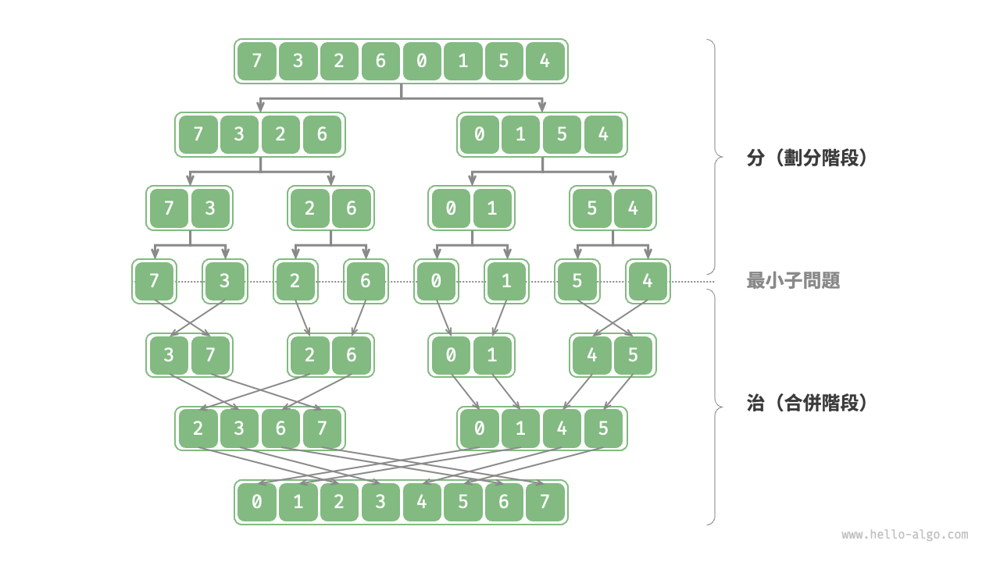
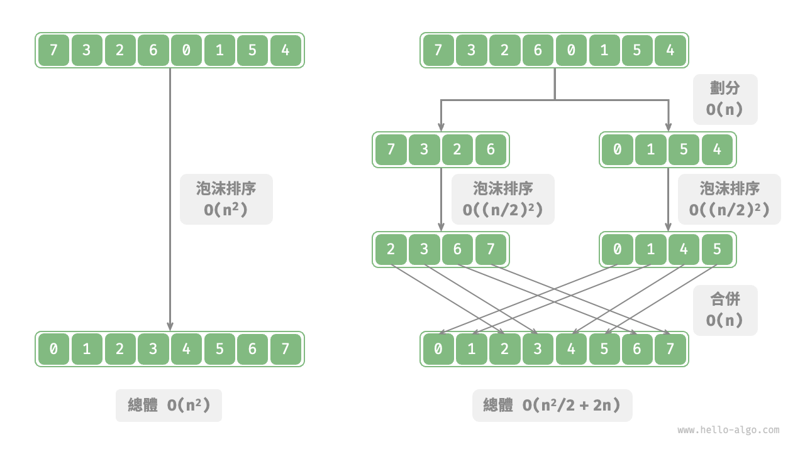
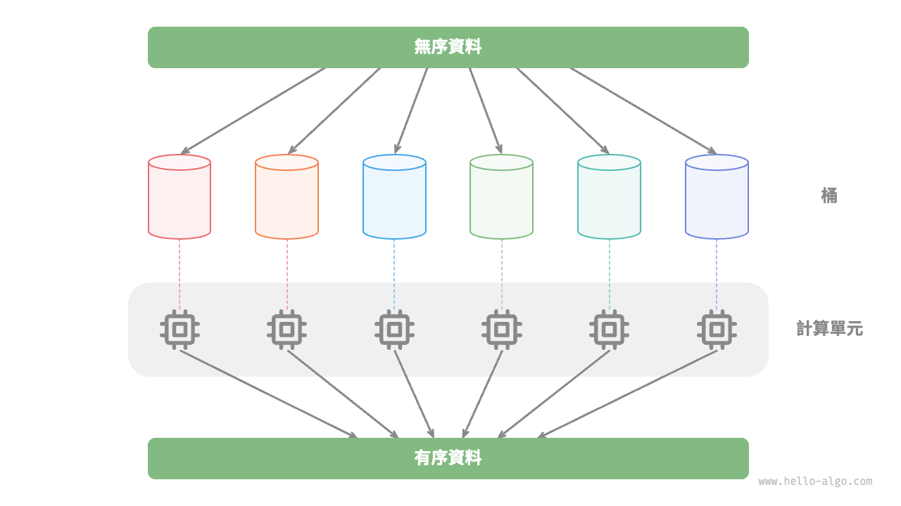

# 分治演算法

<u>分治（divide and conquer）</u>，全稱分而治之，是一種非常重要且常見的演算法策略。分治通常基於遞迴實現，包括“分”和“治”兩個步驟。

1. **分（劃分階段）**：遞迴地將原問題分解為兩個或多個子問題，直至到達最小子問題時終止。
2. **治（合併階段）**：從已知解的最小子問題開始，從底至頂地將子問題的解進行合併，從而構建出原問題的解。

如下圖所示，“合併排序”是分治策略的典型應用之一。

1. **分**：遞迴地將原陣列（原問題）劃分為兩個子陣列（子問題），直到子陣列只剩一個元素（最小子問題）。
2. **治**：從底至頂地將有序的子陣列（子問題的解）進行合併，從而得到有序的原陣列（原問題的解）。

## 如何判斷分治問題

一個問題是否適合使用分治解決，通常可以參考以下幾個判斷依據。

1. **問題可以分解**：原問題可以分解成規模更小、類似的子問題，以及能夠以相同方式遞迴地進行劃分。
2. **子問題是獨立的**：子問題之間沒有重疊，互不依賴，可以獨立解決。
3. **子問題的解可以合併**：原問題的解透過合併子問題的解得來。

顯然，合併排序滿足以上三個判斷依據。

1. **問題可以分解**：遞迴地將陣列（原問題）劃分為兩個子陣列（子問題）。
2. **子問題是獨立的**：每個子陣列都可以獨立地進行排序（子問題可以獨立進行求解）。
3. **子問題的解可以合併**：兩個有序子陣列（子問題的解）可以合併為一個有序陣列（原問題的解）。

## 透過分治提升效率

**分治不僅可以有效地解決演算法問題，往往還可以提升演算法效率**。在排序演算法中，快速排序、合併排序、堆積排序相較於選擇、冒泡、插入排序更快，就是因為它們應用了分治策略。

那麼，我們不禁發問：**為什麼分治可以提升演算法效率，其底層邏輯是什麼**？換句話說，將大問題分解為多個子問題、解決子問題、將子問題的解合併為原問題的解，這幾步的效率為什麼比直接解決原問題的效率更高？這個問題可以從操作數量和平行計算兩方面來討論。

### 操作數量最佳化

以“泡沫排序”為例，其處理一個長度為 $n$ 的陣列需要 $O(n^2)$ 時間。假設我們按照下圖所示的方式，將陣列從中點處分為兩個子陣列，則劃分需要 $O(n)$ 時間，排序每個子陣列需要 $O((n / 2)^2)$ 時間，合併兩個子陣列需要 $O(n)$ 時間，總體時間複雜度為：

$$
O(n + (\frac{n}{2})^2 \times 2 + n) = O(\frac{n^2}{2} + 2n)
$$

接下來，我們計算以下不等式，其左邊和右邊分別為劃分前和劃分後的操作總數：

$$
\begin{aligned}
n^2 & > \frac{n^2}{2} + 2n \newline
n^2 - \frac{n^2}{2} - 2n & > 0 \newline
n(n - 4) & > 0
\end{aligned}
$$

**這意味著當 $n > 4$ 時，劃分後的操作數量更少，排序效率應該更高**。請注意，劃分後的時間複雜度仍然是平方階 $O(n^2)$ ，只是複雜度中的常數項變小了。

進一步想，**如果我們把子陣列不斷地再從中點處劃分為兩個子陣列**，直至子陣列只剩一個元素時停止劃分呢？這種思路實際上就是“合併排序”，時間複雜度為 $O(n \log n)$ 。

再思考，**如果我們多設定幾個劃分點**，將原陣列平均劃分為 $k$ 個子陣列呢？這種情況與“桶排序”非常類似，它非常適合排序海量資料，理論上時間複雜度可以達到 $O(n + k)$ 。

### 平行計算最佳化

我們知道，分治生成的子問題是相互獨立的，**因此通常可以並行解決**。也就是說，分治不僅可以降低演算法的時間複雜度，**還有利於作業系統的並行最佳化**。

並行最佳化在多核或多處理器的環境中尤其有效，因為系統可以同時處理多個子問題，更加充分地利用計算資源，從而顯著減少總體的執行時間。

比如在下圖所示的“桶排序”中，我們將海量的資料平均分配到各個桶中，則可所有桶的排序任務分散到各個計算單元，完成後再合併結果。

## 分治常見應用

一方面，分治可以用來解決許多經典演算法問題。

- **尋找最近點對**：該演算法首先將點集分成兩部分，然後分別找出兩部分中的最近點對，最後找出跨越兩部分的最近點對。
- **大整數乘法**：例如 Karatsuba 演算法，它將大整數乘法分解為幾個較小的整數的乘法和加法。
- **矩陣乘法**：例如 Strassen 演算法，它將大矩陣乘法分解為多個小矩陣的乘法和加法。
- **河內塔問題**：河內塔問題可以透過遞迴解決，這是典型的分治策略應用。
- **求解逆序對**：在一個序列中，如果前面的數字大於後面的數字，那麼這兩個數字構成一個逆序對。求解逆序對問題可以利用分治的思想，藉助合併排序進行求解。

另一方面，分治在演算法和資料結構的設計中應用得非常廣泛。

- **二分搜尋**：二分搜尋是將有序陣列從中點索引處分為兩部分，然後根據目標值與中間元素值比較結果，決定排除哪一半區間，並在剩餘區間執行相同的二分操作。
- **合併排序**：本節開頭已介紹，不再贅述。
- **快速排序**：快速排序是選取一個基準值，然後把陣列分為兩個子陣列，一個子陣列的元素比基準值小，另一子陣列的元素比基準值大，再對這兩部分進行相同的劃分操作，直至子陣列只剩下一個元素。
- **桶排序**：桶排序的基本思想是將資料分散到多個桶，然後對每個桶內的元素進行排序，最後將各個桶的元素依次取出，從而得到一個有序陣列。
- **樹**：例如二元搜尋樹、AVL 樹、紅黑樹、B 樹、B+ 樹等，它們的查詢、插入和刪除等操作都可以視為分治策略的應用。
- **堆積**：堆積是一種特殊的完全二元樹，其各種操作，如插入、刪除和堆積化，實際上都隱含了分治的思想。
- **雜湊表**：雖然雜湊表並不直接應用分治，但某些雜湊衝突解決方案間接應用了分治策略，例如，鏈式位址中的長鏈結串列會被轉化為紅黑樹，以提升查詢效率。

可以看出，**分治是一種“潤物細無聲”的演算法思想**，隱含在各種演算法與資料結構之中。
