# 0-1 背包問題

背包問題是一個非常好的動態規劃入門題目，是動態規劃中最常見的問題形式。其具有很多變種，例如 0-1 背包問題、完全背包問題、多重背包問題等。

在本節中，我們先來求解最常見的 0-1 背包問題。

!!! question

    給定 $n$ 個物品，第 $i$ 個物品的重量為 $wgt[i-1]$、價值為 $val[i-1]$ ，和一個容量為 $cap$ 的背包。每個物品只能選擇一次，問在限定背包容量下能放入物品的最大價值。

觀察下圖，由於物品編號 $i$ 從 $1$ 開始計數，陣列索引從 $0$ 開始計數，因此物品 $i$ 對應重量 $wgt[i-1]$ 和價值 $val[i-1]$ 。

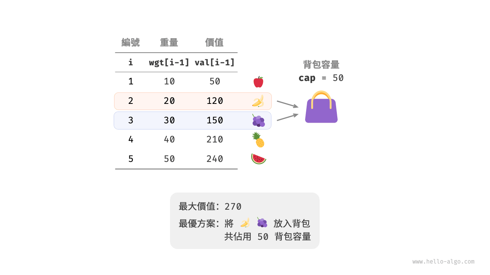

我們可以將 0-1 背包問題看作一個由 $n$ 輪決策組成的過程，對於每個物體都有不放入和放入兩種決策，因此該問題滿足決策樹模型。

該問題的目標是求解“在限定背包容量下能放入物品的最大價值”，因此較大機率是一個動態規劃問題。

**第一步：思考每輪的決策，定義狀態，從而得到 $dp$ 表**

對於每個物品來說，不放入背包，背包容量不變；放入背包，背包容量減小。由此可得狀態定義：當前物品編號 $i$ 和剩餘背包容量 $c$ ，記為 $[i, c]$ 。

狀態 $[i, c]$ 對應的子問題為：**前 $i$ 個物品在剩餘容量為 $c$ 的背包中的最大價值**，記為 $dp[i, c]$ 。

待求解的是 $dp[n, cap]$ ，因此需要一個尺寸為 $(n+1) \times (cap+1)$ 的二維 $dp$ 表。

**第二步：找出最優子結構，進而推導出狀態轉移方程**

當我們做出物品 $i$ 的決策後，剩餘的是前 $i-1$ 個物品的決策，可分為以下兩種情況。

- **不放入物品 $i$** ：背包容量不變，狀態變化為 $[i-1, c]$ 。
- **放入物品 $i$** ：背包容量減少 $wgt[i-1]$ ，價值增加 $val[i-1]$ ，狀態變化為 $[i-1, c-wgt[i-1]]$ 。

上述分析向我們揭示了本題的最優子結構：**最大價值 $dp[i, c]$ 等於不放入物品 $i$ 和放入物品 $i$ 兩種方案中價值更大的那一個**。由此可推導出狀態轉移方程：

$$
dp[i, c] = \max(dp[i-1, c], dp[i-1, c - wgt[i-1]] + val[i-1])
$$

需要注意的是，若當前物品重量 $wgt[i - 1]$ 超出剩餘背包容量 $c$ ，則只能選擇不放入背包。

**第三步：確定邊界條件和狀態轉移順序**

當無物品或無剩餘背包容量時最大價值為 $0$ ，即首列 $dp[i, 0]$ 和首行 $dp[0, c]$ 都等於 $0$ 。

當前狀態 $[i, c]$ 從上方的狀態 $[i-1, c]$ 和左上方的狀態 $[i-1, c-wgt[i-1]]$ 轉移而來，因此透過兩層迴圈正序走訪整個 $dp$ 表即可。

根據以上分析，我們接下來按順序實現暴力搜尋、記憶化搜尋、動態規劃解法。

### 方法一：暴力搜尋

搜尋程式碼包含以下要素。

- **遞迴參數**：狀態 $[i, c]$ 。
- **返回值**：子問題的解 $dp[i, c]$ 。
- **終止條件**：當物品編號越界 $i = 0$ 或背包剩餘容量為 $0$ 時，終止遞迴並返回價值 $0$ 。
- **剪枝**：若當前物品重量超出背包剩餘容量，則只能選擇不放入背包。

```src
[file]{knapsack}-[class]{}-[func]{knapsack_dfs}
```

如下圖所示，由於每個物品都會產生不選和選兩條搜尋分支，因此時間複雜度為 $O(2^n)$ 。

觀察遞迴樹，容易發現其中存在重疊子問題，例如 $dp[1, 10]$ 等。而當物品較多、背包容量較大，尤其是相同重量的物品較多時，重疊子問題的數量將會大幅增多。


### 方法二：記憶化搜尋

為了保證重疊子問題只被計算一次，我們藉助記憶串列 `mem` 來記錄子問題的解，其中 `mem[i][c]` 對應 $dp[i, c]$ 。

引入記憶化之後，**時間複雜度取決於子問題數量**，也就是 $O(n \times cap)$ 。實現程式碼如下：

```src
[file]{knapsack}-[class]{}-[func]{knapsack_dfs_mem}
```

下圖展示了在記憶化搜尋中被剪掉的搜尋分支。

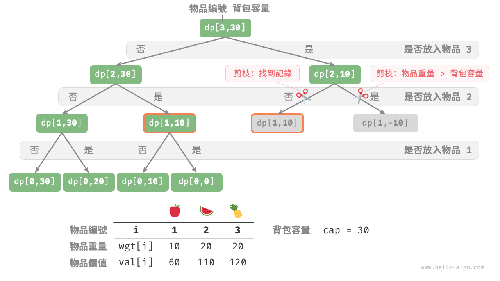

### 方法三：動態規劃

動態規劃實質上就是在狀態轉移中填充 $dp$ 表的過程，程式碼如下所示：

```src
[file]{knapsack}-[class]{}-[func]{knapsack_dp}
```

如下圖所示，時間複雜度和空間複雜度都由陣列 `dp` 大小決定，即 $O(n \times cap)$ 。

=== "<1>"
    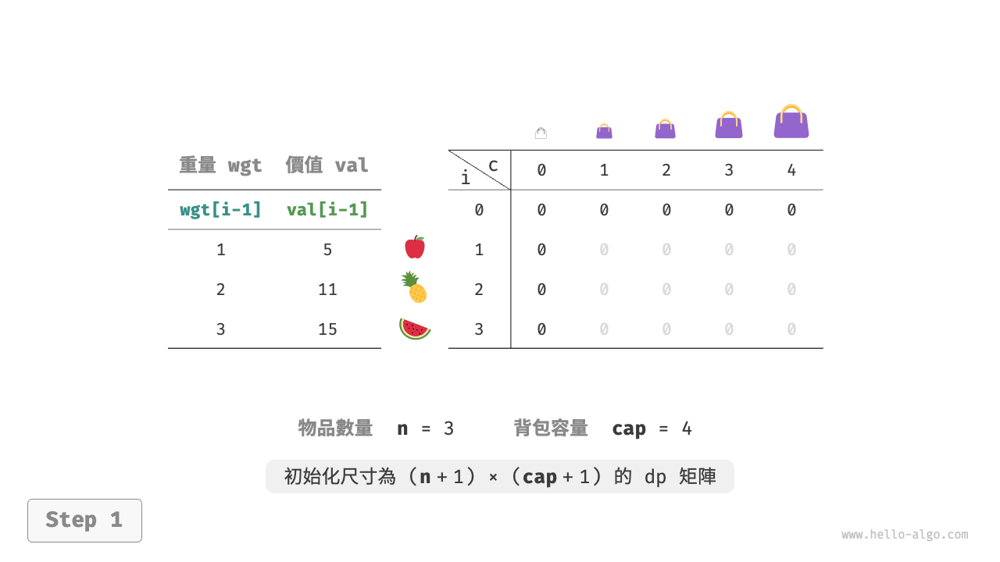

=== "<2>"
    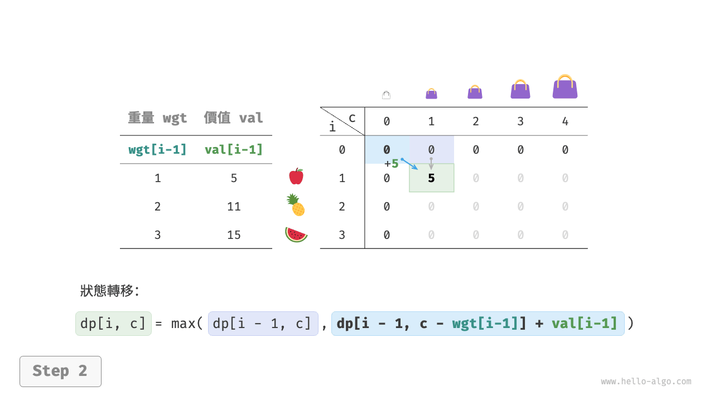

=== "<3>"
    

=== "<4>"
    

=== "<5>"
    

=== "<6>"
    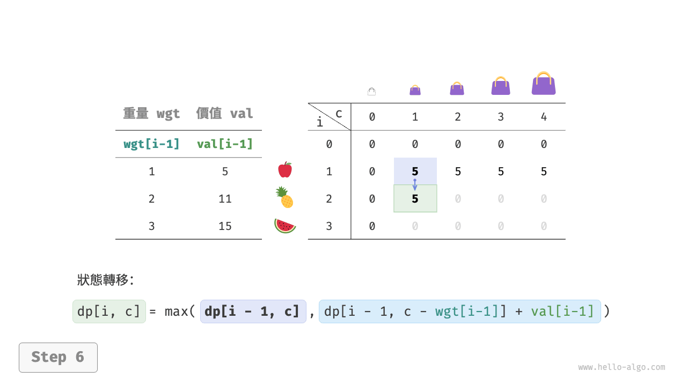

=== "<7>"
    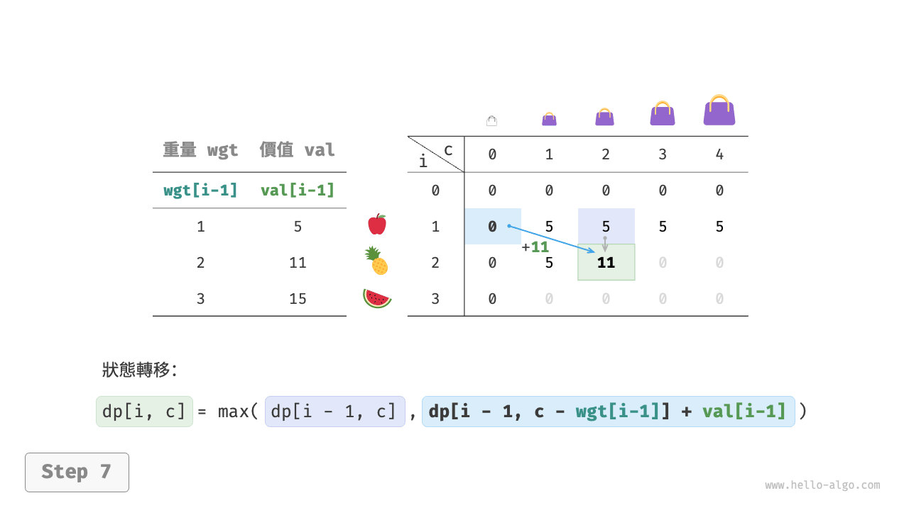

=== "<8>"
    

=== "<9>"
    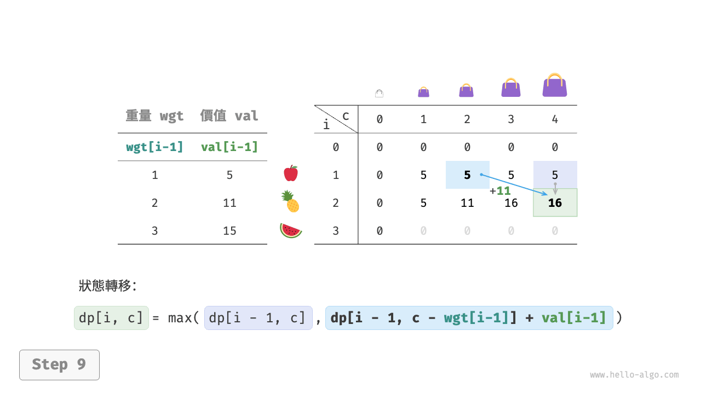

=== "<10>"
    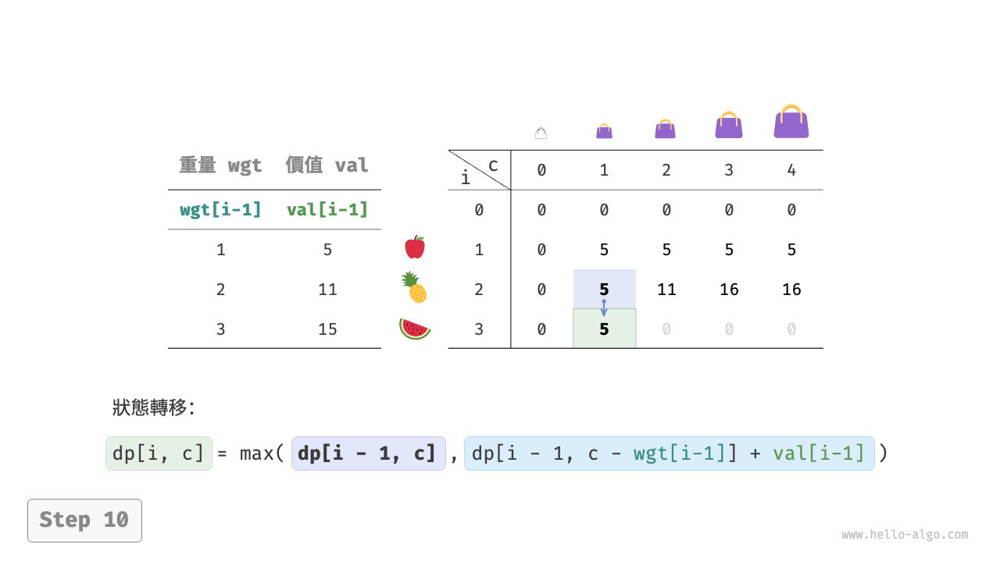

=== "<11>"
    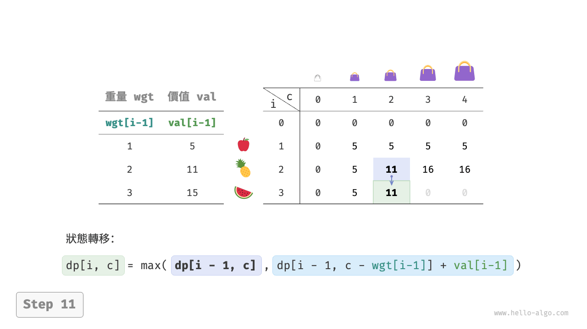

=== "<12>"
    

=== "<13>"
    

=== "<14>"
    

### 空間最佳化

由於每個狀態都只與其上一行的狀態有關，因此我們可以使用兩個陣列滾動前進，將空間複雜度從 $O(n^2)$ 降至 $O(n)$ 。

進一步思考，我們能否僅用一個陣列實現空間最佳化呢？觀察可知，每個狀態都是由正上方或左上方的格子轉移過來的。假設只有一個陣列，當開始走訪第 $i$ 行時，該陣列儲存的仍然是第 $i-1$ 行的狀態。

- 如果採取正序走訪，那麼走訪到 $dp[i, j]$ 時，左上方 $dp[i-1, 1]$ ~ $dp[i-1, j-1]$ 值可能已經被覆蓋，此時就無法得到正確的狀態轉移結果。
- 如果採取倒序走訪，則不會發生覆蓋問題，狀態轉移可以正確進行。

下圖展示了在單個陣列下從第 $i = 1$ 行轉換至第 $i = 2$ 行的過程。請思考正序走訪和倒序走訪的區別。

=== "<1>"
    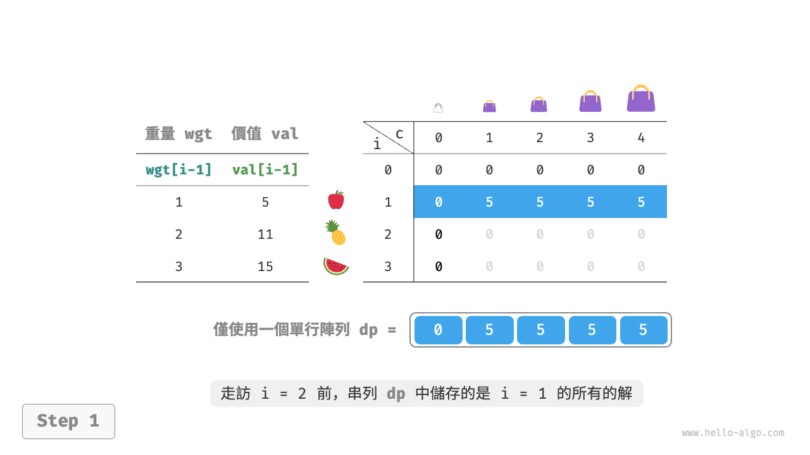

=== "<2>"
    

=== "<3>"
    

=== "<4>"
    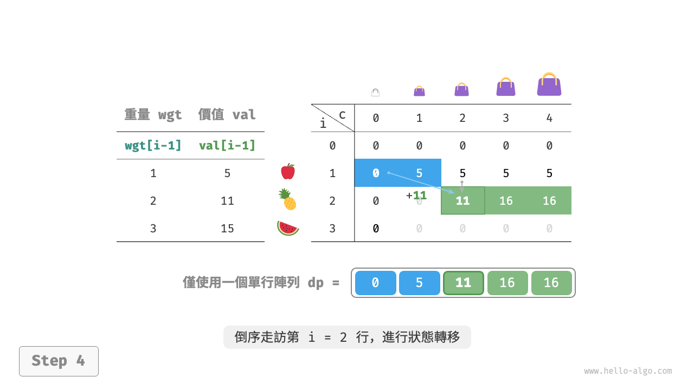

=== "<5>"
    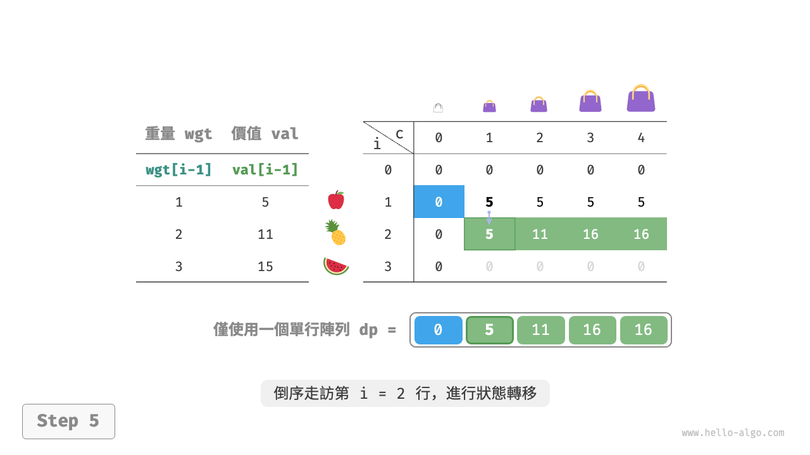

=== "<6>"
    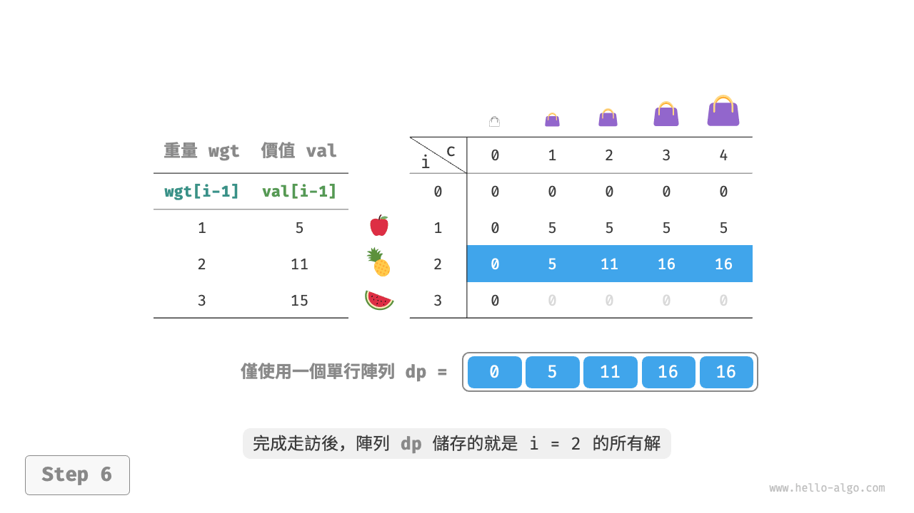

在程式碼實現中，我們僅需將陣列 `dp` 的第一維 $i$ 直接刪除，並且把內迴圈更改為倒序走訪即可：

```src
[file]{knapsack}-[class]{}-[func]{knapsack_dp_comp}
```
